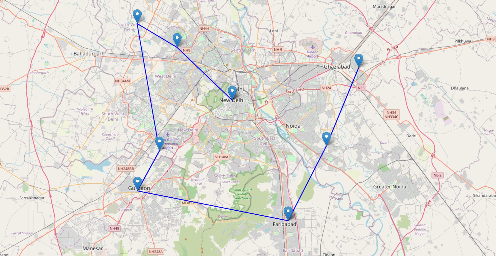

# Delivery Route Optimization using Python

## 📌 Project Overview
This project focuses on optimizing delivery routes for multiple locations to minimize travel distance and improve efficiency. It uses geospatial data and visualizes the optimized route on an interactive map.

## 🚀 Features
- Optimizes delivery route using nearest neighbor approach
- Displays all delivery locations on an interactive map
- Connects locations with an efficient path
- Generates a visual route output in HTML format

## 🛠️ Technologies Used
- Python
- Pandas
- Folium
- Geopy

## 📂 Project Files
- main.py / sace.py → Python script for route optimization
- locations.csv → Input file with location coordinates
- route_map.html → Output interactive map

## ▶️ How to Run
1. Install required libraries:
2. Run the Python file:
3. Open `route_map.html` in your browser

## 📊 Output
The project generates an interactive map showing all delivery points and the optimized route connecting them.
## 📸 Output Image

## 👨‍💻 Author
Rakesh Teja
